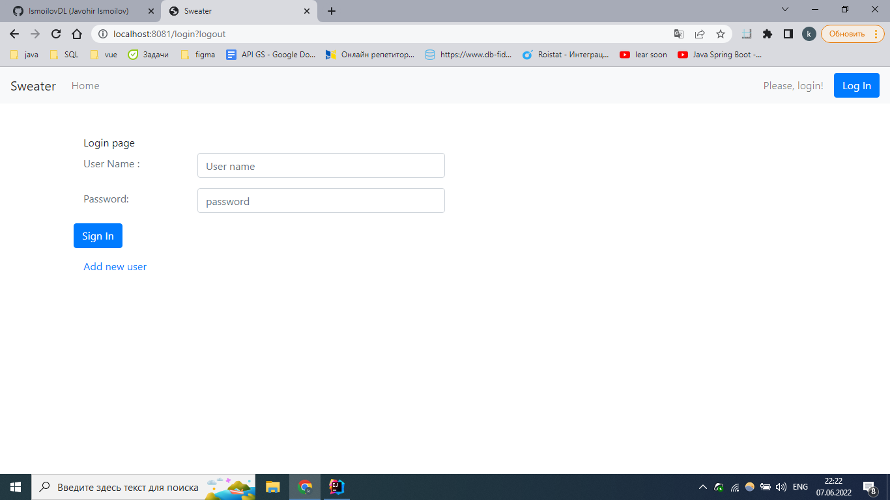
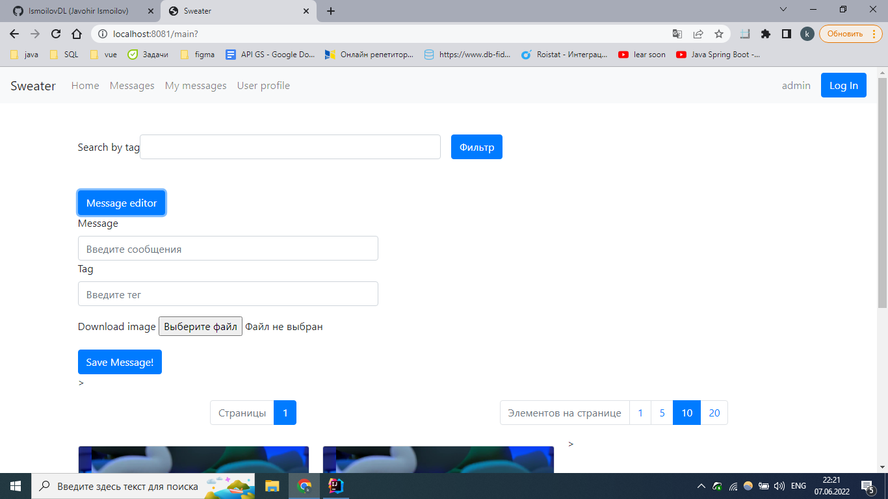
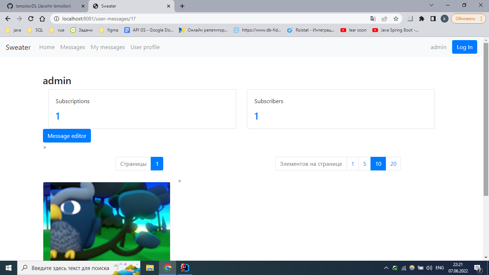

# SWEATER

----
##Spring Application

Приложения разработан для узучения Spring framework

**В проекте используется следующие технологии:**

- Spring MVC
- Шаблонизатор Freemarker
- Spring Data
- Spring Security
- PostgreSQL
- Flyway для миграции БД
- jUnit для написания тестов
- Maven для сборки проекта

-----

###В проекте реализованы следующие функции:

1. Регистрация и вход пользователья
   
2. Добавления, редактирования сообщения и поиск по тегу в сообщениях
   
3. Возможность пользователям подписатся друг на друга
   
4. Провиль пользователя с возможностью изименения пароль и логин
5. Просмотр сообщения других пользователей
